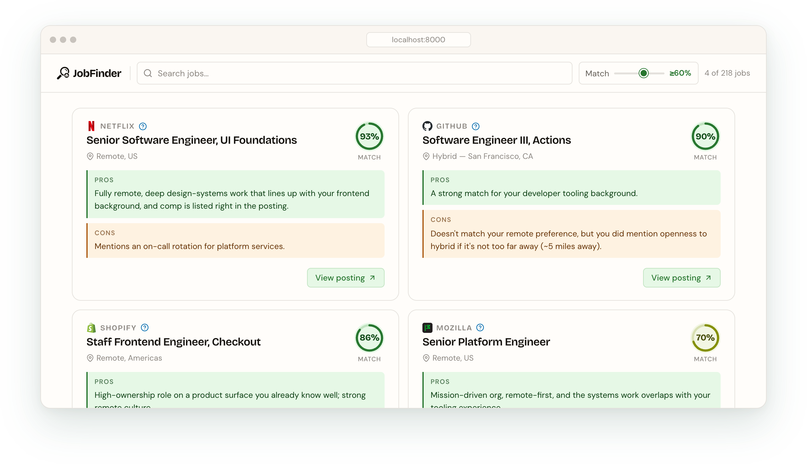

# ai-job-finder

> Let AI read the careers pages for you, so you can spend your time doing literally anything else

## What is it?

This is an Agentic LLM workflow, paired with scrapers for job postings of companies, which I'm building so that I can stop manually browsing through every company's unique careers UI.

The basic flow is this:

1. Use [scrapers](./src/analysis/scraping/) which can reliably fetch all the jobs a given company has available

2. Take the huge list of job titles and locations, and pass them through filtering agents, which cut out any that are clearly not a good fit for the user

3. Fetch the full info for the remaining jobs and send them through an analysis agent, which generates a fitness score as well as pros/cons based on your preferences

## Starting the server

I would recommend installing [Volta](https://volta.sh/), which will auto-fetch and use the correct version of Node.js and Yarn based on my package.json config.

```sh
# install deps
yarn install

# build & start the server
yarn app:build && yarn app:start

# optional HOST and PORT vars can be used
HOST="0.0.0.0" PORT=1337 yarn app:start
```

When you first open it in your browser, you'll need to go through the onboarding flow. Once you've done that, you can start an analysis run and wait for your jobs to show up!

### How long does analysis take to run?

This is dependent on the model you're using and the companies you selected. When I run with Ollama on my gaming PC with all companies selected, it takes ~8.5 hours; so I just let it run overnight. A single company, however, might take 5-10 minutes (or longer if they have many jobs posted).

## LLM Providers

### Ollama

[Ollama](https://ollama.com/) is a wonderful tool for managing and interfacing with **offline LLMs**. I originally started this project with Ollama in mind, as I like the idea of having my PC work for me silently in the background for hours, with no API costs from cloud LLM providers.

I run Ollama on my gaming PC, which has an RTX 4090, and I've found it's very capable for this purpose. I've tested a few different models, but the one I've found to be consistently the best for job analysis is [gpt-oss:20b](https://ollama.com/library/gpt-oss:20b) (which is chosen by default in the onboarding flow).

Whatever model you'd like to use, just make sure to pull it with Ollama before going through the onboarding:

```sh
ollama pull gpt-oss:20b
```

### Claude

Claude is [Anthropic's](https://www.anthropic.com/) LLM models, and while I run the job analysis itself offline on my gaming PC, the code in this repo is largely contributed to by Claude Code (shoutout to Fable).

You can get an API key to use with the job analysis at https://console.anthropic.com.

### ChatGPT

Also a very great set of models (and the creator of the `gpt-oss:20b` model I use with Ollama), ChatGPT is [Open AI's](https://openai.com/) LLM models.

You can get an API key to use with the job analysis at https://platform.openai.com.

## How much does it cost when using paid LLMs?

This is extremely variable based on size of your resume, number of companies chosen, number of jobs available by the company, etc. In the future I may add some token usage estimates that can be compared against paid model pricing for accurate estimates.

## Future features

This is just a side project for me while I'm searching for a new job, so I'm not sure if I'll ever get around to these; but here are some ideas I've had for new features to add to this:

### Showing summarized job content in-UI

Currently it just links to the job posting for matching jobs. Personally, even when faced with the best matching jobs for me, it still can be a bit much to read through so many full job postings, when really I'm interested in like the last paragraph or two of it (typically where it lists what they're actually looking for/what you'll do).

It could be nice to surface an LLM summary of the actually interesting parts of the job posting (possibly inline on each job or in a modal screen).

### Generating answers for application questions

The part I actually find most exhausting about applying to a lot of jobs is how most of them have one or two non-standard questions you need to answer (e.g. "Why do you want to work here?", "What's something cool you've worked on recently?"), and not one single job manager saves this info across pages if you're applying to multiple jobs at the same company.

Similar to the item above this about surfacing job info in the UI, it could be cool to offer up answers to these questions for each job (or maybe generate them on the fly if you find a specific job you're interested in).

I suspect scraping for this info might not be as straightforward as my current scraping approach, but I could be wrong.

### Interview prep

Generating potential questions that may be asked in an interview for a job could be very helpful in prepping for an impending interview. This could also be something that's generated on the fly from a button on each job or something.

Another idea I had was using [faster-whisper](https://github.com/SYSTRAN/faster-whisper) along with some TTS approach to conduct simulated interviews with your chosen model. I suspect this may be a rabbit hole that may take quite a lot of work to get into a state that's actually useful.

## License

[MIT](./LICENSE)
