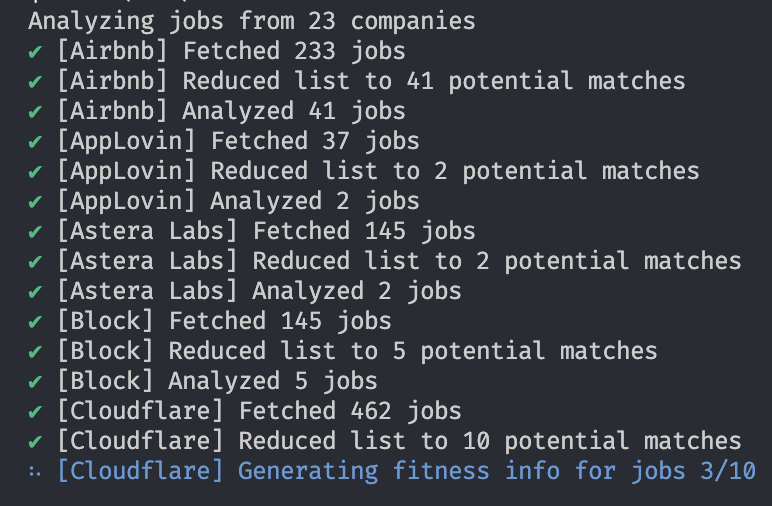
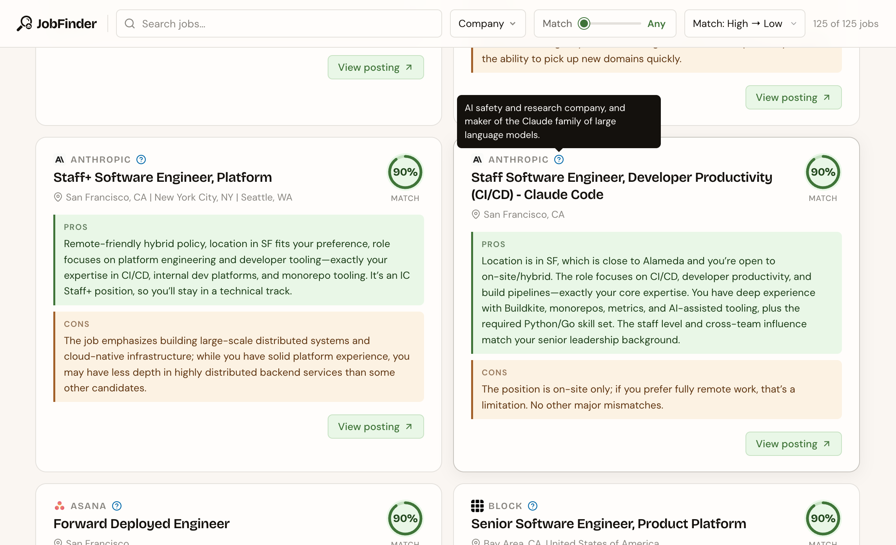

# ai-job-finder

> Let AI browse all those careers listings pages for you, so you can spend your time doing literally anything else

**NOTE**: this is still under development, so everything is subject to change, YMMV, etc. It is usable in its current state, but I'm still doing some fine tuning of the analysis flow to hone in on more reliable and accurate results.

This is an Agentic LLM workflow, paired with scrapers for job postings of popular tech companies, which I'm building so that I can stop manually browsing through every company's unique careers UI.

The current basic flow is this:

1. User drops `resume.md` and `job-preferences.md` into the `.data` directory

2. Use [scrapers](./src/analysis/scraping/) which can reliably fetch all the jobs a given company has available

- Initially I was writing these scrapers manually, but now they're pretty much entirely written by Claude Code via [skills](./.claude/skills/)

3. Take the huge list of job titles and locations, and pass them through a filtering agent, which cuts out any that are clearly not a good fit for the user

4. Fetch the full info for the remaining jobs and send them through an analysis agent, which generates a fitness score as well as pros/cons based on your preferences

## Running analysis

<div align="center">
  
</div>

<br/>

Currently, I run this on my gaming PC, which has an RTX 4090, so is very capable of running many open source LLM models locally.

Tools you'll want to install: [Volta](https://volta.sh/), [Ollama](https://ollama.com/)

Once you have Ollama installed, you'll need to fetch the models I currently use in the analysis flow:

```sh
ollama pull gpt-oss:20b
```

After you've added the `resume.md` and `job-preferences.md` files into the `.data` directory (there's no real format required for these files, just standard markdown files), you can run the analysis via:

```sh
# install deps
yarn install

# run analysis
yarn analyze
```

When it finishes, it'll spit out the results to `~/.ai-job-finder/jobs.json` (which the UI reads from), containing a list of jobs which are potentially a good fit for you & and their fitness scores, pros/cons, etc.

Since the analysis can take hours to run (depending on how many companies it's running against), I personally `ssh` into a WSL linux instance on my gaming PC, and use `tmux` to create a shell that I start the analysis process in and can check in on later.

### Environment vars

If you want to run this from a separate machine than the one running ollama, you can define `OLLAMA_HOST` in a `.env` file (make sure the machine running ollama has the port exposed inside your network). e.g.

**.env**

```
OLLAMA_HOST="http://192.168.1.xxx:11434"
```

## Web UI

<div align="center">
  
</div>

<br/>

The web UI is early in its development, but after you run the analysis, you can run:

```sh
yarn dev
```

OR, for a static production build:

```sh
yarn build && yarn start
```

and you'll see your analyzed job list in the browser.

## License

[MIT](./LICENSE)
