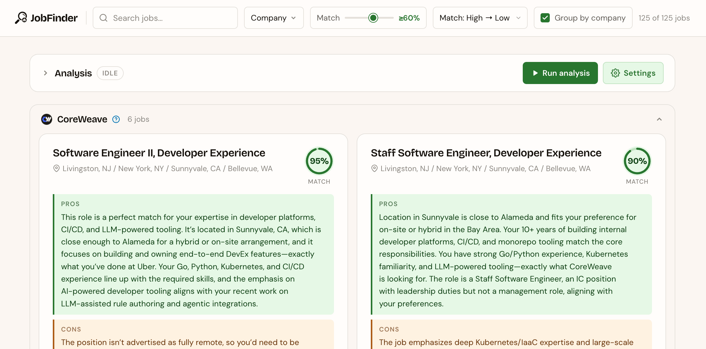
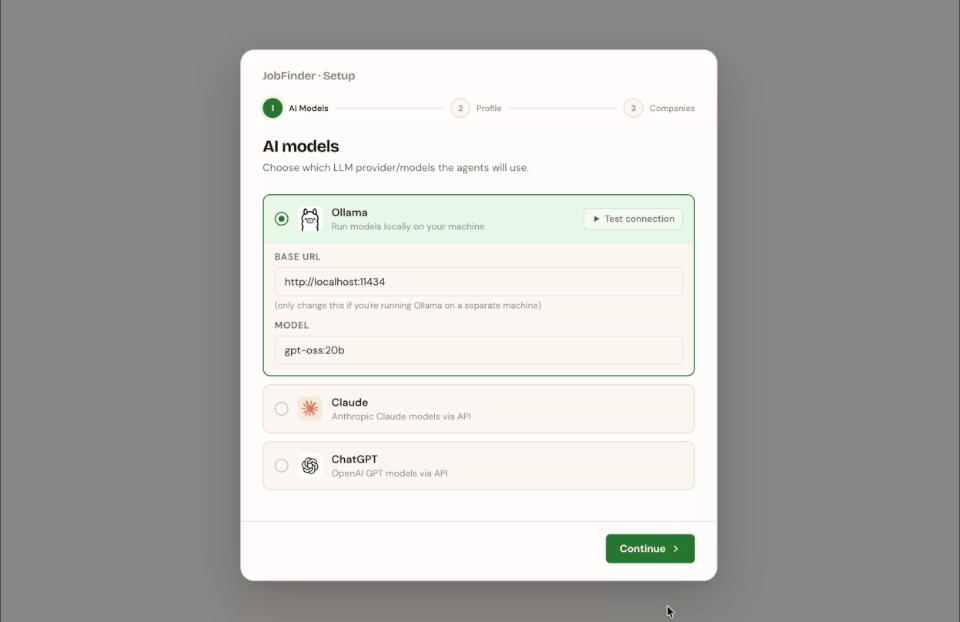
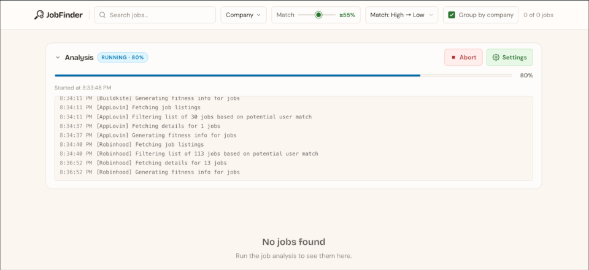

# ai-job-finder

> Let AI browse all those careers listings pages for you, so you can spend your time doing literally anything else

**NOTE**: this is still under development, so everything is subject to change, YMMV, etc. It is very usable in its current state, but I'm still doing some fine tuning of the analysis flow to hone in on more useful results.

## What is it?

This is an Agentic LLM workflow, paired with scrapers for job postings of companies, which I'm building so that I can stop manually browsing through every company's unique careers UI.

The basic flow is this:

1. Use [scrapers](./src/analysis/scraping/) which can reliably fetch all the jobs a given company has available

- Initially I was writing these scrapers manually, but now they're pretty much entirely written by Claude Code via [skills](./.claude/skills/)

3. Take the huge list of job titles and locations, and pass them through a filtering agent, which cuts out any that are clearly not a good fit for the user

4. Fetch the full info for the remaining jobs and send them through an analysis agent, which generates a fitness score as well as pros/cons based on your preferences

## Starting the server

I would recommend installing [Volta](https://volta.sh/), which will auto-fetch and use the correct version of Node.js and Yarn based on my package.json config.

```sh
# install deps
yarn install

# build & start the server
yarn build && yarn start

# optional PORT var can be used
PORT=1337 yarn start
```

When you first open it in your browser, you'll need to go through the onboarding flow:



Once you've done that, you can start an analysis run and wait for your jobs to show up!

### How long does analysis take to run?

Depends on how many companies you selected. When I run with Ollama on my gaming PC with all companies selected, it takes many hours; so I just let it run overnight. A single company, however, takes ~6 minutes.



## LLM Providers

**NOTE**: So far, I've primarily tested the analysis process with Ollama. I'm planning, in the near future, to fully vet Claude and ChatGPT against it to ensure my system prompts provide consistent results across providers.

### Ollama

[Ollama](https://ollama.com/) is a wonderful tool for managing and interfacing with **offline LLMs**. I originally started this project with Ollama in mind, as I like the idea of having my PC work for me silently in the background for hours, with no API costs from cloud LLM providers.

I run Ollama on my gaming PC, which has an RTX 4090, and I've found it's very capable for this purpose. I've tested a few different models, but the one I've found to be consistently the best for job analysis is [gpt-oss:20b](https://ollama.com/library/gpt-oss:20b) (which is chosen by default in the onboarding flow).

Whatever model you'd like to use, just make sure to pull it with Ollama before going through the onboarding:

```sh
ollama pull gpt-oss:20b
```

### Claude

Claude is [Anthropic's](https://www.anthropic.com/) LLM models, and while I run the job analysis itself offline on my gaming PC, the code in this repo is largely contributed to by Claude Code (shoutout to Fable).

You can get an API key to use with the job analysis at https://console.anthropic.com.

### ChatGPT

Also a very great set of models (and the creator of the `gpt-oss:20b` model I use with Ollama), ChatGPT is [Open AI's](https://openai.com/) LLM models.

You can get an API key to use with the job analysis at https://platform.openai.com.

## License

[MIT](./LICENSE)
